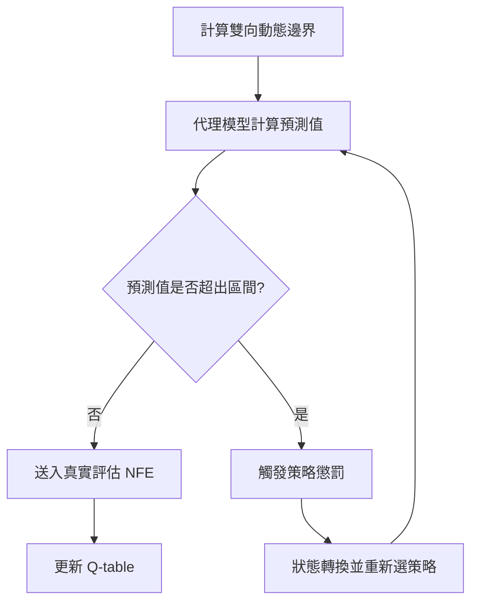

# 一、原始論文架構
* 1. 整體研究設計與雙層學習架構
原始論文關注的是昂貴最佳化問題。此類問題的真實適應值評估可能涉及模擬、有限元素分析或其他高成本計算，因此傳統演化演算法若反覆呼叫真實函數，往往會耗費過多時間。為降低評估成本，論文將整個最佳化系統視為一個「演化取樣代理人」，先利用有限的真實資料建立代理模型，再由代理模型協助判斷哪些候選解最值得進行真實評估。整體流程為：先以 Latin Hypercube Sampling 建立初始資料庫，接著重複選擇取樣策略、產生候選解、執行真實評估、更新資料庫與 Q-table，直到真實函數評估次數達到上限。
ESA 的核心是雙層學習機制。第一層屬於資料驅動學習：各取樣策略根據資料庫中的歷史樣本建立 RBF 代理模型，利用低成本預測取代大量真實評估。第二層屬於策略控制學習：Q-learning 根據上一輪策略是否找到新的歷史最佳解，調整不同策略的 Q 值與後續選擇機率。這種設計使演算法不只學習目標函數的近似形狀，也能學習在不同問題與不同搜尋階段中，哪一種取樣方式較有效。
* 2. 四種演化取樣策略與 Q-learning 控制方式
原始 ESA 建立四種互補的取樣策略。a1 為 DE 演化篩選策略，先由 DE/rand/1 產生一批試驗向量，再以全域代理模型挑出預測值最佳的候選解，主要負責擴大全域探索。a2 為代理模型局部搜尋，選取資料庫中較佳的樣本建立局部 RBF，並以 JADE 在局部範圍內尋找最小預測值，主要負責加速收斂。a3 為完整交叉策略，從歷史優良解中逐一替換各決策變數，透過代理模型篩選每一維較好的組合，以整合既有解的優良基因。a4 為代理模型信賴區域搜尋，在目前最佳解附近進行最多三次局部搜尋，並依照真實改善量與代理模型預測改善量的比率，動態縮小、維持或擴大信賴區域。
Q-learning 以八個狀態表示「上一個動作為哪一種策略」以及「該策略是否成功改善歷史最佳值」，四個動作則分別對應 a1 至 a4。每次行動前，代理人以 SoftMax 根據 Q 值形成選擇機率；若新候選解優於資料庫中的歷史最佳解，獎勵設為 1，否則設為 0，之後再以學習率 0.1、折扣率 0.9 更新 Q-table。藉由這種回饋方式，ESA 能在探索、局部開發、優良基因重組與信賴區域搜尋之間進行自適應調整，而不是固定輪流或完全隨機地使用策略。

---

# 二、研究方法
* 1.程式實作及模型
  本研究以Python分別建立30、50與100維程式，保留原始論文的主要流程，包括LHS初始取樣、真實資料庫、四種取樣策略、Q-learning 狀態轉移與最大函數評估次數控制。每次實驗先產生100個LHS初始樣本並計算真實適應值，之後所有被真實評估的候選解均加入資料庫。程式會依適應值排序歷史資料，並加入距離篩選機制，使被選入代理模型訓練集的優良樣本之間保持最低距離，以降低大量近重複樣本造成的矩陣病態與搜尋停滯。
  本研究為提高高維問題中的數值穩定性，輸入變數先依訓練資料範圍正規化，輸出值再進行標準化；在函數評估次數小於400時，採用Sign-Log轉換壓縮極端適應值，後期則回到原始尺度，以保留接近最佳區域時的細部差異。RBF權重使用加入10⁻⁶正規化的虛擬反矩陣求得，預測值另設動態下限，避免Cubic RBF外插時產生不合理的巨大負值。程式同時記錄訓練RMSE、正則化前後條件數與候選解預測誤差，作為代理模型穩定性的診斷依據。
* 2.演算法執行流程、測試函數與資料輸出
  在每一輪搜尋中，Q-learning代理人先依目前狀態選擇a1、a2、a3或a4。a1以DE產生試驗向量並由全域Cubic RBF篩選；a2在優良樣本所形成的局部範圍內，以JADE最小化代理模型；a3依隨機維度順序逐一交換歷史優良解的變數；a4則在目前最佳解附近建立信賴區域，並依真實與預測改善比率調整搜尋半徑。候選解完成真實函數評估後，若改善歷史最佳值，程式給予獎勵1，否則為0，再更新狀態與Q-table。此流程持續執行至NFE達到1000。
實驗涵蓋Ellipsoid、Rosenbrock、Ackley、Griewank、SRR、RHC1與RHC2七個函數，並分別設定為30、50與100維。每個條件使用五組固定隨機種子10、20、30、40 與50，以平行運算執行。30與50維的SRR、RHC1、RHC2由opfunu的 CEC 2005函數提供；100維版本則依程式中的固定種子產生平移向量與正交旋轉矩陣，以建立對應的高維測試環境。每次執行輸出最佳適應值、平均值、標準差、最佳與最差結果、收斂軌跡、RBF預測誤差、條件數、最終Q-table，以及四種策略的使用次數與比例，作為後續比較不同函數、維度與策略行為的分析資料。

---

# 三、實驗流程

## 第一階段：改善代理模型預測誤差

### 思考與分析：
初步依照論文實作後，發現收斂效果與論文數據相距甚遠，進一步分析數據後發現，RBF 的預測值與真實Fitness之間的誤差很大，且RBF 矩陣的條件數很大，代表矩陣接近奇異矩陣，導致模型對參數變動敏感。

### 實作：
* 核函數替換：將Gaussian Kernel更換為 Cubic Kernel。
* 資料預處理優化：引入 Z-score 標準化。
* 動態邊界約束：針對 RBF 在稀疏區域可能產生的極端預測值，引入動態預測下限規範（預測值不得小於當前最小值之特定比例）。
* 多元樣本篩選：在選取前幾個資料庫中的點訓練代理模型時，確保選取的點之間的距離不會太近，避免奇異矩陣的產生。
* 動態混合配置（最終採納）：為了兼顧初期穩定性與後期精準度，最終配置為：
    * 前 400 NFE：採用 Sign-Log + Z-score 轉換，縮小數值差異，穩定全域架構。
    * 400 NFE 之後：回歸純 Z-score，保留數據細節以提升局部預測精準度

### 結果與推論：
結果fitness進步約2-3個數量級，推測其原因可能在於Cubic核函數不像高斯核會隨距離增加而呈指數級衰減，它在處理不精細、大範圍的全域景觀時可能因此有更好的數值穩定性，而動態預測下限及在選取訓練點時的篩選機制則是讓矩陣計算出來的參數不會過於極端。


## 第二階段:改善a2策略成功率

### 情況:
雖然整體收斂改善，但在精準度上依然與論文結果有差距，同時也發現策略二 (a2) 在所有函數中都沒有成功過(高斯版本中每個函數都有成功過)。

### 分支一：刪除策略 a2
* 嘗試：嘗試直接刪除完全不成功的策略 a2 以節省 NFE 消耗。 
* 結果與推論：整體Fitness反而惡化。推測這可能是因為a2雖然不能直接找到更好的點，但是採樣過程促成了的狀態轉移、樣本空間擴增，有助於其他策略找到最佳解。 

### 分支二：根據策略使用不同核
* 嘗試：針對不同策略的特性配置不同的 RBF 核函數。將局部搜尋策略（a2, a4）換回 Gaussian 核，a1, a3則維持 Cubic 核。 
* 結果：a2 的成功率順利回升，雖然最終 Fitness 未直接提升，但代理模型的整體預測誤差有所下降。 


## 第三階段：其他嘗試

### 分支一：更換Q-Learning
* 嘗試：為了驗證原框架中 Q-Learning 的決策效率，引入了上下文多臂老虎機 (CMAB) 作為對照組。為了讓 Agent 感知環境狀態，設計了一個包含NFE進度 、代理模型精度及收斂停滯數的三維上下文特徵向量。
* 結果與推論：實驗顯示 CMAB 的最終 Fitness 表現比 Q-Learning差。推論可能是因為CMAB 機制較為短視，傾向追求即時回饋；而 Q-Learning 能透過狀態轉移機制進行更多探索，選擇當下回報低、但未來潛力更高或能轉移至優勢狀態的策略。 

### 分支二：融合策略
* 嘗試：嘗試將全域探索 (a1) 與局部細搜 (a2) 整合為單一動作a5，先以a1找到比較好的區域後再以a2找該區比較好的點，最後進行真實評估，期望能減少消耗nfe。
* 結果與推論：Fitness 並未優化。推測可能是因為在有限的nfe下，增加策略數量與對應狀態會擴張Q-table的決策空間，使得代理人難以或較晚在資源耗盡前學會有效的策略切換邏輯。

---

# 四、延伸內容
下述延伸內容皆以 original 版本作為基底進行延伸：
## 延伸研究1：基於Rippa方法的自適應核心選擇 (Adaptive Kernel Selection)
1. 研究動機與背景 (Motivation)
在傳統的代理模型（Surrogate Model）或核函數方法中，選擇最適合的核函數（如 Cubic 或 Gaussian）通常需要耗費大量的計算資源進行交叉驗證與重新訓練。本延伸研究旨在引入 Rippa 方法，在完全不需要重新訓練模型的前提下，實現一瞬間評估多種核函數對各個資料點的預測誤差，進而達到自適應核心（Adaptive Kernel）的動態優化。
2. 理論與研究方法 (Methodology)本方法核心基於 Leave-One-Out 交叉驗證（LOOCV）的誤差估計公式。當原始模型的核矩陣求逆後的對角線數值已知時，第i個資料點在特定核函數下的LOOCV預測誤差e_i可以透過以下公式一瞬間計算完成：

其中：
alpha_i為模型計算出的權重（Weights）
d_i為核矩陣求逆後的對角線數值（Diagonal elements of the inverse kernel matrix）

3.自動化執行流程
* 誤差計算：利用上述公式，在不重新訓練的情況下，分別計算出每個資料點在Cubic與 Gaussian兩種核心下的絕對誤差。
* 自適應選擇 (Adaptive Selection)：針對每一個獨立的資料點，進行自動化比較：
若 則該點動態採用 Cubic核心。反之，則採用Gaussian核心。
* 多維度驗證：此自動化演算法已分別在30dim與50dim的實驗數據上完成獨立驗證。

## 延伸研究2：自適應狀態表示與連續獎勵設計 (Adaptive State Representation and Reward Design)
1. 研究動機與背景 (Motivation)

原始 ESA 使用 Q-learning Agent 選擇不同 surrogate-based optimization operators，但其 state representation 僅包含有限搜尋資訊，且 reward 只根據是否改善判斷，無法反映改善幅度與搜尋階段差異。
本延伸研究旨在提升 Agent 的決策能力，透過更完整的狀態資訊與連續型 reward，使 Q-learning 能根據不同搜尋情境選擇更適合的最佳化策略。

2. 研究方法 (Methodology)

本方法主要包含兩項改進：
* **Adaptive State Representation**

  將原始 ESA 的 8-state 擴展為 72-state，加入：
  
  - Search Stage：Early / Middle / Late
  - Improvement Level：No / Small / Large improvement
  - Success Status：Success / Failure
  
  讓 Agent 能辨識不同搜尋階段與改善程度，學習更適合的 operator selection 策略。
* **Continuous Improvement Reward**

  將原始 Binary Reward：
   `reward = 1 if fitness improved else 0`
  
  改為基於改善比例的連續 reward：
  `reward = improvement / (abs(best_y_before)+1e-12)`
  
  並限制 reward 範圍於 [-1,1]，使 Agent 能區分不同程度的改善效果。

3. 自適應執行流程與驗證 (Evaluation)
* 狀態更新：根據搜尋進度、改善率與成功狀態動態更新 Agent state。
* 策略學習：Q-learning 根據連續 reward 調整不同 operator 的選擇機率。
* 多維度驗證：於 Ellipsoid、Rosenbrock、Ackley、Griewank、SRR、RHC1、RHC2 等基準函數上，分別於 30dim、50dim 與100dim 進行測試。

## 延伸研究3：雙向容忍區間與策略懲罰機制

* **動機**：Original 版本在代理模型預測異常時採用數值截斷，這會導致落入稀疏區、預測值可信度低的樣本點依然被送入真實評估，浪費真實評估資源。
* **主要機制**：在代理模型預測後與送入真實評估前加入一道過濾預測數據，以當前真實最低 Fitness 為基底，結合數據標準差動態制定雙向容忍上下限，若預測值越界則不送入真實評估，並對該決策給予懲罰，同時使 Agent 轉換狀態並重新決策。

<details>
<summary><b> 點擊展開：防禦機制決策流程圖</b></summary>

<div style="max-width: 450px; margin: 10px auto;">


</details>

* **實驗結論**
  * **數據表現**：各測試函數的收斂精度並未有顯著差異，整體尋優表現基本與 Original 版本持平。
  * **推論與反思**：
    * **策略震盪問題**：雖然雙向限制在理論上鎖定了合理的預測範圍，但連續失敗的嘗試與頻繁的策略懲罰，可能因此擾亂了 Q-learning 的更新與探索邏輯。
    * **區間計算方式之缺陷**：以標準差作為動態邊界在實作上面臨兩極化問題。部分函數在優化前期標準差極小，導致容忍區間過於嚴格；而大多數函數在優化後期，標準差遠大於預測數值差距，導致區間過度寬鬆，無法起到實質的限制作用。
    * **探索與利用的失衡**：區間限制雖然過濾了劣質預測，因樣本數不足而預測不準的未知區域更難以被探索到，扼殺了潛在的全局尋優路徑，使模型過度傾向於即時的 Fitness 收斂進而可能陷入局部最佳解。

  **(註：延伸研究3完整細節，詳見 [bound](./bound/README.md) )**
---

# 五、實驗數據與實驗結果圖表分析
## 30維實驗結果（開發與改良階段）
30維測試主要用於驗證 ESA 架構改良過程，包含代理模型改善、策略調整以及 Agent 決策機制比較。
### 5.1第一階段:改善代理模型預測誤差
* 比較原始 ESA 與改良後 RBF surrogate model 的差異。
* 分析不同 Kernel、資料標準化方法以及樣本選擇策略對收斂效果的影響。
實驗資料：
* Fitness 結果比較
* RBF 預測誤差
* Convergence history

* 結果fitness進步約2-3個數量級，推測其原因可能在於Cubic核函數不像高斯核會隨距離增加而呈指數級衰減，它在處理不精細、大範圍的全域景觀時可能因此有更好的數值穩定性，而動態預測下限及在選取訓練點時的篩選機制則是讓矩陣計算出來的參數不會過於極端。

SUMMARY STATISTICS MATRIX
| Function | Best | Worst | Mean | Std Dev |
| :--- | :---: | :---: | :---: | :---: |
| Ellipsoid | 2.998492e-03 | 1.769557e-02 | 6.473637e-03 | 5.640612e-03 |
| Rosenbrock | 2.756659e+01 | 2.938571e+01 | 2.853395e+01 | 7.267102e-01 |
| Ackley | 1.283946e-01 | 5.571260e-01 | 2.914800e-01 | 1.921870e-01 |
| Griewank | 2.790092e-01 | 8.565065e-01 | 5.737082e-01 | 2.047932e-01 |
| SRR | -2.362454e+02 | -5.090273e+01 | -1.268907e+02 | 6.933218e+01 |
| RHC1 | 2.149206e+02 | 5.222809e+02 | 3.363790e+02 | 1.149951e+02 |
| RHC2 | 9.126642e+02 | 9.206502e+02 | 9.162500e+02 | 2.669143e+00 |


### 5.2第二階段：改善a2策略成功率
* 分析 Cubic Kernel 導致 a2 策略成功率下降的問題。
* 比較刪除 a2 與 Hybrid Kernel Strategy 的影響。

實驗資料：
* 不同策略配置下的 Best Fitness
* Action 成功率
* Kernel 預測誤差

#### 分支一:
* 結果與推論：整體Fitness反而惡化。推測這可能是因為a2雖然不能直接找到更好的點，但是採樣過程促成了的狀態轉移、樣本空間擴增，有助於其他策略找到最佳解。 
SUMMARY STATISTICS MATRIX

| Function | Best | Worst | Mean | Std Dev |
| :--- | :---: | :---: | :---: | :---: |
| Ellipsoid | 4.277050e-03 | 5.549932e-02 | 1.554553e-02 | 2.001028e-02 |
| Rosenbrock | 2.722595e+01 | 2.787695e+01 | 2.758104e+01 | 2.224292e-01 |
| Ackley | 1.340312e-01 | 6.403628e-01 | 2.506651e-01 | 1.952379e-01 |
| Griewank | 3.367765e-01 | 7.930625e-01 | 5.549692e-01 | 1.640460e-01 |
| SRR | -2.388466e+02 | -2.252509e+01 | -1.423539e+02 | 8.284134e+01 |
| RHC1 | 2.120482e+02 | 3.902936e+02 | 2.984559e+02 | 7.236709e+01 |
| RHC2 | 9.140408e+02 | 9.215871e+02 | 9.171045e+02 | 2.978535e+00 |


#### 分支二:
* 結果：a2 的成功率順利回升，雖然最終 Fitness 未直接提升，但代理模型的整體預測誤差有所下降。 
SUMMARY STATISTICS MATRIX

| Function | Best | Worst | Mean | Std Dev |
| :--- | :---: | :---: | :---: | :---: |
| Ellipsoid | 2.080207e-03 | 8.932726e-03 | 5.609240e-03 | 2.257009e-03 |
| Rosenbrock | 2.760375e+01 | 2.810366e+01 | 2.793458e+01 | 1.935795e-01 |
| Ackley | 1.142880e-01 | 2.082583e+00 | 9.517090e-01 | 7.506540e-01 |
| Griewank | 6.602763e-01 | 8.392521e-01 | 7.447078e-01 | 6.300701e-02 |
| SRR | -2.533169e+02 | -7.981912e+01 | -2.006565e+02 | 6.313259e+01 |
| RHC1 | 2.144357e+02 | 4.447704e+02 | 3.161504e+02 | 8.124374e+01 |
| RHC2 | 9.159692e+02 | 9.251510e+02 | 9.194437e+02 | 3.335801e+00 |


### 5.3第三階段：其他嘗試
#### 分支一：更換Q-Learning
* 結果與推論：實驗顯示 CMAB 的最終 Fitness 表現比 Q-Learning差。推論可能是因為CMAB 機制較為短視，傾向追求即時回饋；而 Q-Learning 能透過狀態轉移機制進行更多探索，選擇當下回報低、但未來潛力更高或能轉移至優勢狀態的策略。 
SUMMARY STATISTICS MATRIX

| Function | Best | Worst | Mean | Std Dev |
| :--- | :---: | :---: | :---: | :---: |
| Ellipsoid | 6.670062e-03 | 1.059794e+00 | 2.352557e-01 | 4.128725e-01 |
| Rosenbrock | 2.770798e+01 | 6.243835e+01 | 3.649733e+01 | 1.324426e+01 |
| Ackley | 3.412613e-01 | 2.808709e+00 | 1.872058e+00 | 9.068718e-01 |
| Griewank | 7.528685e-01 | 8.747236e+01 | 1.816234e+01 | 3.465508e+01 |
| SRR | -2.736850e+02 | -1.959882e+02 | -2.410858e+02 | 2.579714e+01 |
| RHC1 | 2.242905e+02 | 5.254416e+02 | 3.114634e+02 | 1.084116e+02 |
| RHC2 | 9.143472e+02 | 9.451815e+02 | 9.238585e+02 | 1.101254e+01 |


#### 分支二：融合策略
* 結果與推論：Fitness 並未優化。推測可能是因為在有限的nfe下，增加策略數量與對應狀態會擴張Q-table的決策空間，使得代理人難以或較晚在資源耗盡前學會有效的策略切換邏輯。
SUMMARY STATISTICS MATRIX

| Function | Best | Worst | Mean | Std Dev |
| :--- | :---: | :---: | :---: | :---: |
| Ellipsoid | 4.611535e-03 | 2.003572e-02 | 8.697136e-03 | 5.707746e-03 |
| Rosenbrock | 2.751465e+01 | 2.880014e+01 | 2.807501e+01 | 4.827848e-01 |
| Ackley | 1.036111e-01 | 5.759488e-01 | 2.089749e-01 | 1.841245e-01 |
| Griewank | 3.350779e-01 | 5.017031e-01 | 4.281633e-01 | 7.214297e-02 |
| SRR | -2.421654e+02 | -3.997124e+01 | -1.846304e+02 | 7.432425e+01 |
| RHC1 | 2.148707e+02 | 6.371653e+02 | 3.461564e+02 | 1.511865e+02 |
| RHC2 | 9.129259e+02 | 9.245724e+02 | 9.181666e+02 | 3.764006e+00 |


### 5.4終版
SUMMARY STATISTICS MATRIX
| Function | Best | Worst | Mean | Std Dev |
| :--- | :---: | :---: | :---: | :---: |
| Ellipsoid | 2.998492e-03 | 1.769557e-02 | 6.473637e-03 | 5.640612e-03 |
| Rosenbrock | 2.756659e+01 | 2.938571e+01 | 2.853395e+01 | 7.267102e-01 |
| Ackley | 1.283946e-01 | 5.571260e-01 | 2.914800e-01 | 1.921870e-01 |
| Griewank | 2.790092e-01 | 8.565065e-01 | 5.737082e-01 | 2.047932e-01 |
| SRR | -2.362454e+02 | -5.090273e+01 | -1.268907e+02 | 6.933218e+01 |
| RHC1 | 2.149206e+02 | 5.222809e+02 | 3.363790e+02 | 1.149951e+02 |
| RHC2 | 9.126642e+02 | 9.206502e+02 | 9.162500e+02 | 2.669143e+00 |


## 50維實驗結果(終版)
SUMMARY STATISTICS MATRIX
| Function | Best | Worst | Mean | Std Dev |
| :--- | :---: | :---: | :---: | :---: |
| Ellipsoid | 1.369316e+02 | 2.168324e+02 | 1.831941e+02 | 3.450437e+01 |
| Rosenbrock | 2.022741e+02 | 3.142801e+02 | 2.569127e+02 | 3.751878e+01 |
| Ackley | 8.601083e+00 | 1.103635e+01 | 1.004204e+01 | 8.165020e-01 |
| Griewank | 1.812844e+01 | 2.567847e+01 | 2.148626e+01 | 2.793551e+00 |
| SRR | 2.046844e+02 | 2.810709e+02 | 2.341738e+02 | 2.731080e+01 |
| RHC1 | 4.431538e+02 | 5.781589e+02 | 5.002263e+02 | 4.879833e+01 |
| RHC2 | 1.055342e+03 | 1.173545e+03 | 1.102110e+03 | 4.505245e+01 |


## 100維實驗結果(終版)
SUMMARY STATISTICS MATRIX
| Function | Best | Worst | Mean | Std Dev |
| :--- | :---: | :---: | :---: | :---: |
| Ellipsoid | 2.568343e+03 | 3.780567e+03 | 3.016932e+03 | 4.069508e+02 |
| Rosenbrock | 1.635958e+03 | 2.023618e+03 | 1.844161e+03 | 1.507966e+02 |
| Ackley | 1.494919e+01 | 1.604402e+01 | 1.557528e+01 | 3.529554e-01 |
| Griewank | 2.152502e+02 | 2.744213e+02 | 2.410985e+02 | 2.610692e+01 |
| SRR | 9.054557e+02 | 1.075647e+03 | 9.932388e+02 | 6.270935e+01 |
| RHC1 | 2.537969e+02 | 2.624466e+02 | 2.575530e+02 | 3.013509e+00 |
| RHC2 | 1.460853e+02 | 1.533317e+02 | 1.496832e+02 | 2.648687e+00 |


---
## 執行

### 檢查與安裝相依套件
本延伸實驗除基礎數學與繪圖模組（Numpy, Matplotlib）外，核心測試函數依賴 `opfunu` 基準測試套件。執行前請確保已切換至相應環境並安裝：
```bash
pip install opfunu
```
---
#  專案開發與實作聲明
本專案之核心目標為實作論文 **《Evolutionary Sampling Agent for Expensive Problems》** 之算法主架構，並在此基礎上增加相關延伸機制。本專案之理論研究、演算法邏輯架構與延伸模組均由人類團隊主導，並採用「人類主導、AI 執行」之監督式協同開發模式。

基於開源社群資訊透明度與學術誠信原則，特此正式說明本專案之分工架構：

### 1. 研究團隊核心貢獻 
研究團隊在本專案中擔任系統架構師、算法診斷者與決策者之核心角色，具體工作包含：
* **論文架構重現與延伸設計**：深度研讀並解析原論文之 Evolutionary Sampling Agent 核心邏輯，並思考、評估延伸內容架構。
* **深度分析與核心決策**：在審視實驗數據並參考 AI 提供的初步分析後，由研究團隊進行深度的獨立思考與二次推斷，釐清演算法的真實因果關係，並最終決定具體的優化方向與機制的具體解決方案。 
* **技術複核與品質把關**：負責對 AI 生成的所有程式碼進行邏輯審查與異常排除。手動修復、校正 AI 實作中產生的技術錯誤與 Bug，確保最終整體系統運行之正確性與嚴謹性。
* **數據真實性之確保**：本專案所呈現之所有實驗數據與收斂圖表，均由研究團隊將程式碼部署於本地環境後真實運行產出，絕無任何 AI 模擬或人工修改數據之行為。

### 2. 生成式 AI 之執行範疇
本專案引進大型語言模型作為高階執行、程式碼轉譯與分析輔助工具，具體範疇如下：
* **程式碼具體實作**：依據研究團隊給定之論文公式、核心邏輯架構與演算法偽代碼，由 AI 協助將其轉譯並撰寫為具體的 Python 程式碼模組與功能函式。
* **前期探索與初步分析輔助**：在遭遇演算法瓶頸或實驗異常時，利用 AI 提供相關背景知識、領域資料梳理，並針對異常數據提供初步的現象分析與多種潛在解決方向，作為研究團隊深化思考之激盪基底。 

