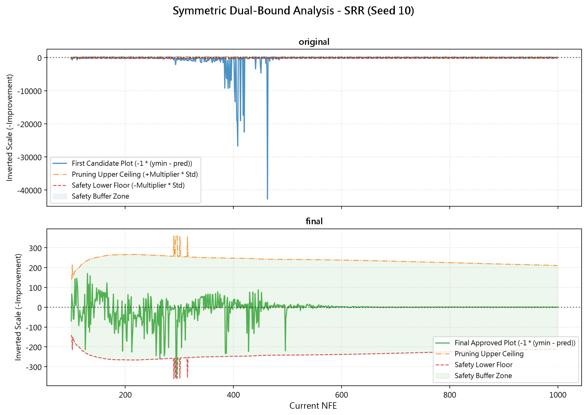

#雙向容忍區間與懲罰機制
##  研究動機 
針對代理模型在稀疏區域可能產生的極端預測值，我們原先設計是先以動態預測下限，若超過下限則直接進行數值截斷，強制將預測值拉回邊界內。然而，在深入分析後，我認為這樣的做法可能存在以下缺陷：
* **模型盲目**：當代理模型計算出極度誇張或不合理的 Fitness 預測值時，很可能代表樣本點落入了資料庫未曾覆蓋的稀疏區域，在這樣狀態下，代理模型的預測結果可信度較低。
* **浪費真實評估資源**：如果只做數值截斷，演算法仍會將這個亂猜的點送入真實評估，導致真實評估資源的浪費。

因此，實作的動機在於：與其被動修正錯誤的預測值並硬送去評估，不如建立一套主動防禦過濾機制，即時攔截無效預測，重新選擇策略與預測點。

## 版本基準配置
此延伸實驗是以 original 版本為基底，並針對其進行以下兩項核心配置調整，以此作為實驗基準：

* **核函數異質配置**：策略 a2, a4 選用 Gaussian 核，策略 a1, a3 則選用 Cubic 核。
* **策略一動態預處理**：在 Z-score 標準化的基礎上，針對策略 a1 進行動態調整。在優化初期（NFE < 400）進行 Sign-Log 轉換以穩定全域架構；NFE >= 400 之後則回歸純 Z-score 以保留數據細節。

## 實作設計 (Implementation Details)

在代理模型預測後與送入真實評估前加入一道主動攔截過濾網，具體執行步驟如下：

### 1. 計算雙向動態邊界 (步驟一)
在每一次迭代開始時，演算法會先計算目前資料庫中所有已知真實數據的標準差（sigma），並找出當前真實數據的最低 Fitness  作為基底。利用倍數參數 k定義合理區間：
* 下限 = Fitness_min - (k * sigma)
* 上限 = Fitness_min + (k * sigma)

### 2. 攔截與區間判定 (步驟二)
當 Agent 選擇某一策略並透過代理模型計算出一個預測 Fitness 值後，進行區間檢查：
* **在區間內**：若預測值落在 [下限, 上限] 之間，判定預測合理，正常將該點送入真實評估並更新資料庫與 Q-table。
* **超出區間**：若預測值超出範圍，判定模型在此樣本點的評估可信度較低，不送入真實評估**。

### 3. 策略懲罰與重新決策 (步驟三、四)
若預測值被判定為異常攔截：
* **給予懲罰**：直接在 Q-table 中對剛剛選擇的那個策略給予懲罰更新Q-table，並轉換狀態。
* **重選策略**：Agent 在新狀態下重新選擇一次策略並產生新預測點，返回步驟 2 重新判定。

### 4. 區間動態放寬機制 (步驟五)
為避免演算法在極端情況下陷入死循環（即連續選擇策略皆無法產生落在區間內的點）：
* 若 Agent 連續嘗試了 n 次皆未能通過區間判定，則將倍數參數 k 擴大一定比例，放寬上下限。
* 放寬後，Agent 再次嘗試 n 次，直到成功送出評估為止。

## 實驗數據對比 (Experimental Results)：

### 1. 基準版本 (未加入機制)
| Function | Best | Worst | Mean | Std Dev |
| :--- | :---: | :---: | :---: | :---: |
| Ellipsoid | 2.080207e-03 | 8.932726e-03 | 5.609240e-03 | 2.257009e-03 |
| Rosenbrock | 2.760375e+01 | 2.810366e+01 | 2.793458e+01 | 1.935795e-01 |
| Ackley | 1.142880e-01 | 2.082583e+00 | 9.517090e-01 | 7.506540e-01 |
| Griewank | 6.602763e-01 | 8.392521e-01 | 7.447078e-01 | 6.300701e-02 |
| SRR | -2.533169e+02 | -7.981912e+01 | -2.006565e+02 | 6.313259e+01 |
| RHC1 | 2.144357e+02 | 4.447704e+02 | 3.161504e+02 | 8.124374e+01 |
| RHC2 | 9.159692e+02 | 9.251510e+02 | 9.194437e+02 | 3.335801e+00 |

### 2. 延伸實驗版本 (加入機制)
| Function | Best | Worst | Mean | Std Dev |
| :--- | :---: | :---: | :---: | :---: |
| Ellipsoid | 3.442023e-03 | 8.129712e-03 | 5.872457e-03 | 1.669258e-03 |
| Rosenbrock | 2.717036e+01 | 2.939904e+01 | 2.870453e+01 | 8.861587e-01 |
| Ackley | 1.261789e-01 | 1.427666e+00 | 4.648643e-01 | 4.997132e-01 |
| Griewank | 3.987439e-01 | 8.677623e-01 | 6.724465e-01 | 1.592263e-01 |
| SRR | -2.537926e+02 | -1.214496e+02 | -1.869415e+02 | 4.343004e+01 |
| RHC1 | 2.388573e+02 | 4.441037e+02 | 3.744613e+02 | 7.081227e+01 |
| RHC2 | 9.166678e+02 | 9.244324e+02 | 9.202452e+02 | 2.739376e+00 |

### i. 動態容忍區間運作示意
本機制的雙向動態邊界實際執行狀況如下圖（以 Ackley 函數 Seed 10 , SRR 函數 Seed 10 為例)。可以觀測到邊界隨著數據標準差的改變進行動態縮放，並攔截了越界的無效預測：

*(註：其餘各函數的完整收斂歷程圖，請參見 [plots/convergence/](./plots/convergence/) 資料夾)*
## 結果與推論
* **實驗結果**：各測試函數的收斂精度並未有顯著差異，整體尋優表現基本與原版持平。
* **推論與反思**：
    * *策略震盪問題*：雖然雙向限制在理論上鎖定了合理的預測範圍，但連續失敗的嘗試與頻繁的策略懲罰，可能擾亂了 Q-learning 的更新與探索邏輯。
    * *區間計算方式之缺陷*：以標準差作為動態邊界在實作上面臨兩極化問題，部分函數在優化前期標準差極小，導致容忍區間過於嚴格；而大多數函數在優化後期，標準差遠大於預測數值差距，導致區間過度寬鬆，無法起到實質的限制作用。
    * *探索與利用的失衡*：區間限制雖然過濾了劣質預測，因樣本數不足而預測不準的未知區域更難以被探索到，扼殺了潛在的全局尋優路徑，使模型過度傾向於即時的 Fitness 收斂進而可能陷入局部最佳解。

